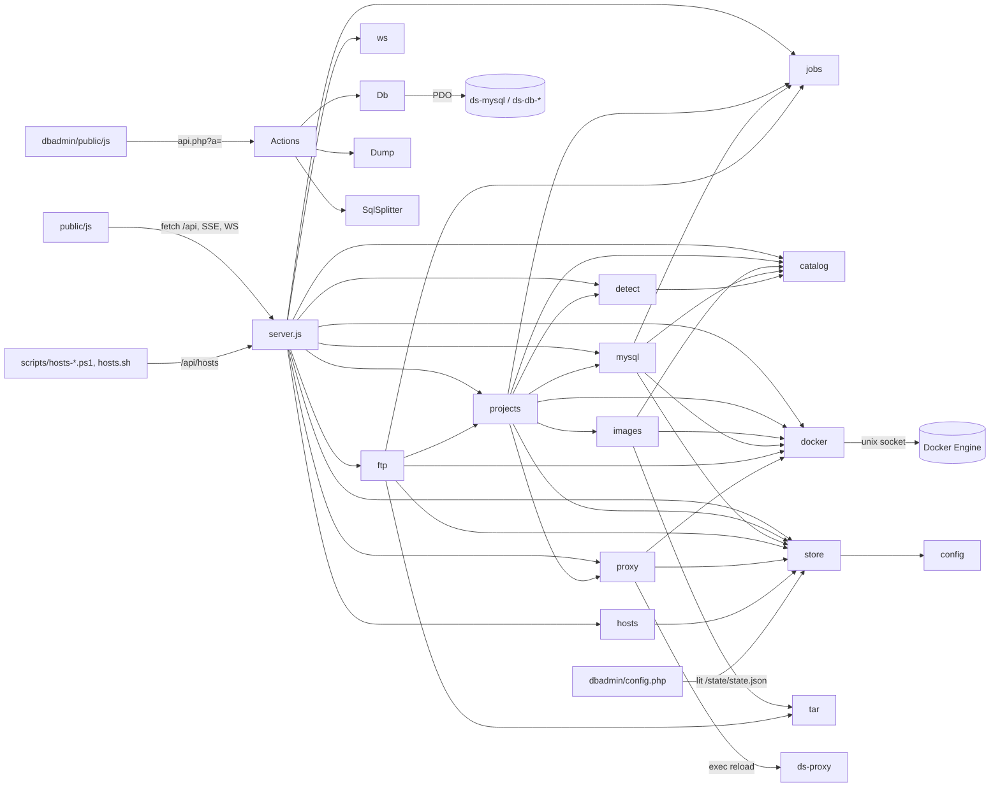

# ARCHITECTURE — docker-server

## 1. Identité

| | |
|---|---|
| Nom | docker-server (`dashboard/lib/config.js` → `APP`, `VERSION` 0.1.0) |
| Rôle | Serveur de développement PHP local piloté par un tableau de bord web. Chaque dossier de `repo/` devient un site `*.localhost` servi par son propre container PHP+Apache. Gère aussi serveurs MySQL/MariaDB, comptes FTP, Xdebug, Mailpit, DB Admin. |
| Stack socle | Docker Compose ; Caddy 2 (proxy HTTP/HTTPS, certificats locaux) ; Node 22 (dashboard, **zéro dépendance npm**) ; PHP 8.4 + Apache (DB Admin) ; Mailpit |
| Stack projets | Images `php:<X.Y>-apache` (5.6 → 8.5) construites à la demande, extensions via install-php-extensions, Composer, Node optionnel |
| Front | JS natif en modules ES (aucun build), xterm.js vendorisé |
| Point d'entrée | `docker-compose.yml` → service `dashboard` → `node dashboard/server.js` (port interne 8000) |
| Démarrer | Windows : `start.cmd` (→ `scripts/start.ps1`) · macOS/Linux : `./start.sh` · brut : `docker compose up -d` |
| Arrêter | `stop.cmd` (→ `scripts/stop.ps1`) / `./stop.sh` : stoppe les containers labellisés `docker-server.kind` puis `docker compose stop` |
| Utilitaires | `hosts.cmd` / `hosts.sh` (bloc hosts), `import-mysql.cmd` (→ `scripts/import-mysql.ps1`) |
| Tests | Aucun test automatisé dans le dépôt |
| Langue | Code, commentaires, messages UI et erreurs **en français** |

## 2. Arborescence

```
docker-server/
├─ docker-compose.yml       socle : proxy, dashboard, dbadmin, mailpit + réseau « docker-server »
├─ .env.example             ports / version MySQL / TZ / BIND_IP (copie → .env, non versionné)
├─ start.* stop.* hosts.* import-mysql.cmd   lanceurs (cmd → scripts/*.ps1 ; sh autonomes)
├─ scripts/                 PowerShell Windows + mysql-tool.sh (exécuté DANS un container MySQL)
├─ dashboard/               tableau de bord Node.js
│  ├─ server.js             serveur HTTP + routes API + SSE + WebSocket + boot
│  ├─ lib/                  modules métier (docker, projets, images, mysql, ftp, proxy, store…)
│  └─ public/               SPA : index.html, css/app.css, js/{app,lib}.js, js/views/, js/components/
│     └─ vendor/xterm/      ⚠ VENDORISÉ (xterm.mjs, addon-fit.mjs, xterm.css) — ne pas lire
├─ dbadmin/                 DB Admin (alternative phpMyAdmin), monté dans ds-dbadmin
│  ├─ config.php            serveurs (déduits de data/state.json), limites, allowed_hosts
│  ├─ php.ini               php.ini du container DB Admin (→ conf.d/zz-dbadmin.ini)
│  ├─ start.sh              installe pdo_mysql au 1er démarrage, docroot → /app/public
│  ├─ src/                  classes PHP (Actions, Db, Dump, SqlSplitter, Guard, Http, Config)
│  └─ public/               api.php (routeur), index.html, js/*.js, custom.js/custom.css (zone utilisateur)
├─ server/
│  ├─ caddy/Caddyfile       sites fixes (localhost, dbadmin, mailpit, *.localhost 404) + import sites générés
│  ├─ php/apache.conf       conf Apache commune injectée dans chaque image projet
│  ├─ ftp/                  Dockerfile + entrypoint.sh + vsftpd.conf de l'image ds-ftp
│  └─ templates/welcome.php page d'accueil copiée dans un « Nouveau dossier »
├─ repo/                    ► PROJETS UTILISATEUR (non versionnés sauf README/.gitkeep)
└─ data/                    ⚠ GÉNÉRÉ (non versionné) : état + artefacts dérivés
   ├─ state.json            SOURCE DE VÉRITÉ unique
   ├─ projects/<slug>/php.ini   php.ini généré par projet (monté RO dans le container)
   ├─ proxy/sites.caddy     routes Caddy générées
   ├─ caddy/                données Caddy (CA locale, certificats)
   ├─ backups/              dumps SQL (changement de version, sauvegardes, import)
   ├─ cache/                outils téléchargés (install-php-extensions, composer.phar), TTL 24 h
   ├─ ftp/<user>/           dossier FTP par défaut d'un compte
   └─ hosts-agent.pid       PID de l'agent hosts Windows
```

## 3. Containers

| Container | Origine | Image | Rôle | Réseau / ports |
|---|---|---|---|---|
| `ds-proxy` | compose | `caddy:2-alpine` | Reverse proxy `*.localhost` + HTTPS local | `BIND_IP:HTTP_PORT→80`, `BIND_IP:HTTPS_PORT→443` |
| `ds-dashboard` | compose | `node:22-alpine` | API + SPA, pilote Docker via `/var/run/docker.sock` | interne 8000 ; monte `.` sur `/workspace` |
| `ds-dbadmin` | compose | `php:8.4-apache` | DB Admin | interne 80 ; monte `dbadmin/`→`/app`, `data/backups`→`/backups`, `data/`→`/state:ro` |
| `ds-mailpit` | compose | `axllent/mailpit` | Capture SMTP (1025), UI (8025) | interne |
| `ds-<slug>` | dashboard | `ds-php:<php>-<hash10>` | Un container par projet (Apache+PHP) | interne 80 ; label `docker-server.kind=project` |
| `ds-mysql` | dashboard | `mysql:<v>` / `mariadb:<v>` | Serveur BDD par défaut (alias réseau = id `mysql`) | `BIND_IP:MYSQL_PORT→3306` ; volume `ds-mysql-data` |
| `ds-db-<id>` | dashboard | idem | Serveurs BDD supplémentaires | port hôte auto ≥ 3307 ; volume `ds-db-<id>-<engine><ver>` |
| `ds-ftp` | dashboard | `ds-ftp:<hash10>` (build `server/ftp/`) | vsftpd, un bind mount par compte → `/ftp/<user>` | `FTP_PORT→21` + plage passive |

Tous sur le réseau Docker `docker-server`. Labels : `docker-server.kind` ∈ {`project`, `php-image`, `ftp`, `ftp-image`, …}, `docker-server.slug`, `docker-server.spec` (hash de la spec pour décider recréation vs redémarrage).

## 4. Flux d'exécution

### Boot du dashboard (`server.js` → `start()`)
1. `server.listen(cfg.PORT)` immédiatement (`/api/health` répond `ready:false`).
2. Boucle `findHostRoot()` : inspecte `ds-dashboard`, trouve le montage de `/workspace` → `cfg.hostRoot` (chemin hôte, requis pour tous les bind mounts). Erreurs → `boot.error`.
3. Réconciliation, dans cet ordre : `proxy.applyWithRetry()` → `mysql.ensureDefault()` (sinon `mysql.reconcile()`) → `ftp.reconcile()` → `projects.reconcile()` (réécrit tous les php.ini, recrée les containers manquants).
4. `boot.ready = true`.

### Requête HTTP navigateur
```
navigateur → ds-proxy (Caddy)
  ├ localhost / 127.0.0.1 / ds-dashboard → ds-dashboard:8000
  │    server.js : allowedHost() (anti DNS-rebinding) → sameOrigin() pour écritures (anti-CSRF)
  │    ├ /api/jobs/:id/stream  → streamJob (SSE)
  │    ├ /api/logs/:container  → streamLogs (SSE, docker logs follow)
  │    ├ /api/*                → table `routes` (regex) → handler({params, query, body, req}) → JSON
  │    ├ upgrade /api/terminal → ws.accept + docker.execAttach (TTY)
  │    └ sinon                 → serveStatic(public/, fallback index.html)
  ├ dbadmin.localhost → ds-dbadmin:80 → public/api.php?a=<action> : Guard::check → Actions::a_<action>(Http::params())
  ├ mailpit.localhost → ds-mailpit:8025
  ├ <domaines projets> (data/proxy/sites.caddy) → snippet (projet) → ds-<slug>:80 ; 502/503/504 → page « projet arrêté »
  └ http://*.localhost inconnu → page 404 « Aucun projet »
```

### Création / modification d'un projet
`POST /api/projects` → `projects.create(input)` → `detect.detect(folder)` → `normalize()` → `store.update` → `writeIni()` → `runJob()` :
`ensureDatabase()` (mysql.waitReady + createDatabase, non bloquant) → `ensureRunning()` :
`images.ensure()` (build si tag absent ; dédoublonné par `building` Map ; 3 tentatives sur erreur réseau) → `writeIni()` → `containerSpec()` → recrée si hash spec différent sinon start/restart → `proxy.apply()` (régénère sites.caddy + reload Caddy via exec).

`PUT /api/projects/:slug` → `projects.update()` calcule l'impact :
| Changement | Impact | Action |
|---|---|---|
| PHP / extensions / Node (tag image) | `build` | rebuild image + recreate + prune images |
| docroot / 1er domaine / `aliases` | `recreate` | recreate container |
| `ini` / `iniExtra` / `xdebug` (php.ini) | `restart` | réécrit `data/projects/<slug>/php.ini` + `docker restart` (jamais de rebuild) |
| base de données | `database` | ensureDatabase |
| domaines / httpsRedirect seuls | `proxy` | `proxy.apply()` sans job |

### Jobs
`jobs.run(title, meta, fn)` : file **séquentielle globale** (promesse chaînée), `Job` émet `log` / `steps` / `status` / `end` ; suivi par SSE `/api/jobs/:id/stream`. `meta.key` (`project:<slug>`, `mysql:<id>`, `ftp`, `exec:<slug>`) sert à `activeFor(key)` → statut `working`.

## 5. Modules backend — dashboard (`dashboard/lib/`, CommonJS)

| Module | Exports (signature) | Rôle | Dépend de |
|---|---|---|---|
| `config.js` | objet : `WORKSPACE, REPO_DIR, DATA_DIR, SERVER_DIR, PUBLIC_DIR, NETWORK, SELF, PROXY, MAILPIT, FTP, LABEL, PORT, bindIp, httpPort, httpsPort, mysqlPort, mysqlVersion, ftpPort, ftpPasvMin, ftpPasvMax, timezone, dbPassword, legacyDbPasswords, hostRoot` | Constantes + env | — |
| `store.js` | `get(): State`, `update(fn: (s)=>T): T`, `save()`, `writeInPlace(file, content)`, `FILE` | Persistance atomique de `data/state.json` (tmp+rename ; fichier illisible → copie `.broken-<ts>`). `writeInPlace` garde l'inode (fichiers montés seuls) | config |
| `catalog.js` | `PHP_VERSIONS[]`, `EXTENSIONS[]{id,label,group,desc,min?,max?}`, `BUILTIN[]`, `DEFAULT_EXTENSIONS[]`, `DB_ENGINES{mysql,mariadb}`, `PHP_INI_DEFAULTS{}`, `cmp(a,b): number`, `extensionsFor(php)`, `filterExtensions(list, php): string[]`, `xdebugMajor(php): 2\|3` | Catalogue de ce que l'UI propose | — |
| `detect.js` | `detect(folder, preferredPhp): Detection`, `listFolders(): string[]`, `listSubfolders(): string[]` (niveau 2, hors vendor/node_modules/…), `tooling(folder)`, `slugify(s)`, `satisfies(php, constraint): bool`, `pickPhp(constraint, preferred)` | Détection framework / PHP (composer `require.php` ou `config.platform.php`) / docroot / `ext-*` / Node / nom de base (`.env*`, `wp-config.php`) | config, catalog |
| `docker.js` | `request()`, `json(method, path, body, {allow, timeout})`, `streamJson()`, `inspect(name)`, `list(labelFilter)`, `create(name, spec, platform?)`, `start/stop/restart(name, t?)`, `remove(name, {volumes})`, `imageExists(ref)`, `removeImage`, `listImages(ref)`, `pull(image, {platform,onEvent})`, `build(tar, tag, {onEvent, labels})`, `removeVolume`, `volumeExists`, `info()`, `execCreate`, `exec(container, cmd, {user, env, workdir, onLine}): {code}`, `execAttach`, `execResize(id, cols, rows)`, `logs(container, {tail, follow, since, onLine, onEnd})` | Client Docker Engine API brut via socket unix | http |
| `images.js` | `dockerfile(p, {remote}): string`, `tagFor(p): string`, `configKey(p): string`, `ensure(p, job): Promise<tag>`, `phpIni(p): string`, `prune(usedTags)` | Génère Dockerfile + **php.ini projet**, construit les images `ds-php:*`, télécharge/cache les outils | config, catalog, docker, tar |
| `projects.js` | `list()`, `pending()`, `details(slug)`, `create(input): Job`, `update(slug, input): {job, impact}`, `start(slug): Job`, `stop(slug)`, `restart(slug)`, `rebuild(slug): Job`, `remove(slug, {dropDatabase})`, `command(slug, cmd): Job`, `reconcile()`, `containerName(p)`, `get(slug)`, `owner(folder): {uid,gid}`, `pruneImages(job?)`, `createFolder(name, template)`, `giveToOwner(target, reference)` | Cycle de vie des projets | config, catalog, detect, docker, images, jobs, mysql, proxy, store |
| `mysql.js` | `containerName(inst)`, `label(inst)`, `image(inst)`, `waitReady(inst, job, timeout)`, `ensureDefault(): bool`, `reconcile()`, `create({id, engine, version, sqlMode}): Job`, `backup(id): Job`, `changeVersion(id, {...}): Job`, `remove(id, {purge})`, `status(inst)`, `databases(id)`, `validDbName(name)`, `createDatabase(id, name)`, `dropDatabase(id, name)`, `defaultInstance()`, `httpError(status, msg)` | Serveurs MySQL/MariaDB : provision, dump→recréation→réimport lors d'un changement de version (ancien volume conservé), conversion ancien mdp root | config, catalog, docker, store, jobs |
| `ftp.js` | `create({user, password, path, label})`, `update(user, {...})`, `remove(user)`, `status()`, `reconcile()`, `restart()`, `filezilla(user): xml`, `password(len=14)`, `publicAccount(a)` | Container unique ds-ftp recréé à chaque changement de comptes | config, docker, store, jobs, tar, projects |
| `proxy.js` | `url(host, https): string`, `generate(state): string`, `apply()`, `applyWithRetry(tries)`, `rootCa(): string\|null` | Génère `data/proxy/sites.caddy`, recharge Caddy | config, docker, store |
| `hosts.js` | `entries()`, `needsHosts(host)`, `setReport(present[])`, `status(): {agent, entries, missing\|null, retry}`, `askAgain()`, `DASHBOARD_HOST` | Noms hors `.localhost` à déclarer dans le fichier hosts ; état rapporté par l'agent Windows (timeout 15 s) | store |
| `jobs.js` | `run(title, meta, fn): Job`, `runAndWait(...)`, `get(id)`, `all()`, `active()`, `activeFor(key)` ; classe `Job extends EventEmitter` : `log(text)`, `step(label)`, `summary()` | Tâches longues sérialisées avec logs/étapes | events |
| `tar.js` | `tar(files: {name: string\|Buffer\|{content, mode}}): Buffer` | Archive tar minimale (contexte de build) | — |
| `ws.js` | `accept(req, socket, head): WsConnection` | WebSocket RFC 6455 minimal (terminal) | crypto, events |

`server.js` (non exporté) : `send()`, `readBody()` (max 1 Mo, JSON), `sse()`, `allowedHost()`, `sameOrigin()`, `route()`, `services()`, `streamJob()`, `streamLogs()`, `terminal()`, `serveStatic()`, `findHostRoot()`, `start()`.

## 6. Graphe de dépendances



## 7. Routes — API dashboard (`dashboard/server.js`)

Aucune authentification (outil local). Garde : `allowedHost` sur toutes les requêtes ; `sameOrigin` sur les écritures. Erreurs : `{error}` + statut (`e.status`, défaut 500).

| Méthode | URI | Handler | Entrée | Sortie |
|---|---|---|---|---|
| GET | `/api/health` | inline | — | `{ok, ready}` |
| GET | `/api/overview` | inline | — | `{app, boot, config, settings, projects[], pending[], ignored[], mysql[], ftp, services[], jobs[], ca, hosts}` |
| GET | `/api/catalog` | catalog | — | `{php, extensions, builtin, defaultExtensions, db, iniDefaults}` |
| GET | `/api/detect` | projects.detectFolder | `folder` (query : relatif, `repo/…` ou chemin hôte complet sous repo/) | Detection (`folder` normalisé) ; 400 hors repo/ ou `..`, 404 absent |
| POST | `/api/projects` | projects.create | `{folder \| newFolder, template?, slug?, name?, php?, extensions?, node?, docroot?, xdebug?, ini?, iniExtra?, domains?, aliases?, httpsRedirect?, database?}` | `{job}` |
| GET | `/api/projects/:slug` | list + details | — | projet + `{tooling, dockerfile, phpIni, image, xdebugMajor, webroot, docrootPath, hostFolder, database}` |
| PUT | `/api/projects/:slug` | projects.update | mêmes clés que POST (partielles) | `{job\|null, impact}` |
| DELETE | `/api/projects/:slug` | projects.remove | `dropDatabase=1` (query) | `{ok}` |
| POST | `/api/projects/:slug/command` | projects.command | `{command: string}` | `{job}` |
| POST | `/api/projects/:slug/:action` | start/rebuild → `{job}` ; stop/restart → `{ok}` | action ∈ start, rebuild, stop, restart | |
| POST | `/api/mysql` | mysql.create | `{id, engine, version, sqlMode}` | `{job}` |
| PUT | `/api/mysql/:id` | mysql.changeVersion | `{engine, version, sqlMode}` | `{job}` |
| DELETE | `/api/mysql/:id` | mysql.remove | `purge=1` | `{ok}` |
| GET / POST | `/api/mysql/:id/databases` | databases / createDatabase | POST `{name}` | liste / `{ok}` |
| DELETE | `/api/mysql/:id/databases/:name` | dropDatabase | — | `{ok}` |
| POST | `/api/mysql/:id/:action` | backup → `{job}` ; start/stop/restart → `{ok}` | | |
| GET | `/api/ftp` | inline | — | `{status, host, port, pasv, accounts[]}` |
| GET | `/api/ftp-password` | ftp.password | — | `{password}` |
| POST / PUT / DELETE | `/api/ftp`, `/api/ftp/:user` | ftp.create/update/remove | `{user, password?, path?, label?}` | compte public / `{ok}` |
| GET | `/api/ftp/:user/filezilla.xml` | ftp.filezilla | — | XML (attachment) |
| GET | `/api/folders` | detect.listSubfolders | — | `{subfolders: string[]}` (autocomplétion) |
| POST | `/api/folders` | projects.createFolder | `{name, template}` (`empty` ou page d'accueil) | `{folder}` |
| POST / DELETE | `/api/folders/:folder/ignore` | projects.ignore(folder, true / false) | folder URL-encodé | `{ok}` ; 404 si dossier absent (POST) |
| POST | `/api/services/:id/restart` | inline | id ∈ proxy, dbadmin, mailpit, ftp | `{ok}` |
| PUT | `/api/settings` | inline | `{php?, timezone?}` | settings |
| POST | `/api/maintenance/prune` | projects.pruneImages | — | `{removed[]}` |
| GET | `/api/ca.crt` | proxy.rootCa | — | certificat CA (attachment) ; 404 si pas encore généré |
| GET | `/api/hosts` | hosts | `format=text` → texte brut | `{agent, entries, missing, retry}` |
| POST | `/api/hosts/report` | hosts.setReport | `{present: string[]}` | `{ok}` |
| POST | `/api/hosts/retry` | hosts.askAgain | — | `{ok}` |
| GET | `/api/jobs` | jobs.all | — | Job.summary[] |
| GET (SSE) | `/api/jobs/:id/stream` | streamJob | — | events `init?`, `log`, `steps`, `end` |
| GET (SSE) | `/api/logs/:container` | streamLogs | `tail` (10–5000, déf. 500), `since?` | lignes de log |
| WS | `/api/terminal` | terminal | `container` (`^ds-…`), `root=1`, cols/rows (à confirmer) | TTY bidirectionnel |

## 8. Routes — DB Admin (`dbadmin/public/api.php`)

Routage : `?a=<action>` (regex `^[a-z]+(\.[a-z]+)*$`) → `Actions::a_<action avec . → _>(Http::params())`. Params = JSON body + POST + GET fusionnés. Garde `Guard::check()` : `allowed_hosts`, `Sec-Fetch-Site`, `Origin`. Erreurs : `{ok:false, error, code?}` (400 / 403 / 404). Paramètre serveur commun : `s` (id serveur).

| Action | Paramètres | Rôle |
|---|---|---|
| `servers` | — | Liste des serveurs de config.php |
| `ping` | `s` | Test connexion / version |
| `meta` | `s` | Charsets, collations, moteurs, types |
| `processlist` | `s` | Requêtes en cours |
| `dbs` | `s` | Bases + tailles |
| `tables` | `s, db` | Tables / vues d'une base |
| `table` | `s, db, table` | Structure : colonnes, index, FK, statut, DDL |
| `db.copy` | `s, from, to, data` | Copie de base |
| `schema` | `s, db` | Schéma relationnel (vue graphe) |
| `rows` | `s, db, table, filters, where, sort, size, page, exact` | Données paginées |
| `cell` | `s, db, table, col, key` | Valeur complète d'une cellule |
| `row.update` | `s, db, table, set, key` | Mise à jour d'une ligne |
| `row.insert` | `s, db, table, values` | Insertion |
| `row.delete` | `s, db, table, keys` | Suppression |
| `sql` | `s, db?, sql, limit, mode, cursor` | Exécution SQL multi-requêtes (SqlSplitter) |
| `backups` | `s` | Liste des dumps de `/backups` |
| `import` | `s, db?, backup? \| fichier multipart, stop` | Import SQL en flux |
| `export` | `s, opts` | Dump SQL en téléchargement (réponse brute, `null` → pas de JSON) |

### Classes PHP (`dbadmin/src/`, sans namespace, `final`, chargées par `bootstrap.php`)

| Classe | Méthodes publiques | Rôle |
|---|---|---|
| `Config` | `get(key: string, default: mixed): mixed` | Lit `config.php` (mémoïsé) |
| `Http` | `json(data, status=200): never`, `fail(message, status=400, extra=[]): never`, `params(): array` | Réponses JSON / params |
| `UserError extends RuntimeException` | — | Erreur affichable telle quelle |
| `Guard` | `check(): void` | Anti DNS-rebinding / CSRF |
| `Db` | `server(id): array`, `connect(id, buffered=true, fresh=false): PDO`, `killQuery(server, connectionId): void`, `q(name): string`, `qt(db, table): string`, `lit(pdo, value): string`, `message(Throwable): [string, code]` | Connexions PDO, quoting, messages d'erreur |
| `Dump` | `__construct(server, o: array, write: Closure)`, `run(): void`, `programs(pdo, db, ?tables): array`, `dumpColumns(pdo, db, table): array` | Export SQL en flux (structure, données, vues, routines) |
| `SqlSplitter` | `split(sql): array`, `feed(chunk): array`, `finish(): array` | Découpe SQL en flux (chaînes, commentaires, `DELIMITER`) |
| `Actions` | `a_*` (tableau ci-dessus) ; privées `pdo`, `need`, `columns`, `keyColumns`, `keyWhere`, `where`, `cell`… | Contrôleur unique |

## 9. APIs externes consommées

| Client | Cible | Méthode / chemin | Payload / réponse | Auth |
|---|---|---|---|---|
| `dashboard/lib/docker.js` | Docker Engine API via `/var/run/docker.sock` | `/containers/*`, `/images/*`, `/build`, `/volumes/*`, `/exec/*`, `/info` | JSON Docker ; flux NDJSON (build/pull) ; `allow[]` = statuts tolérés (ex. 404, 304) | accès socket |
| `images.js` `download()` | Sources publiques d'install-php-extensions (GitHub releases, jsDelivr, raw GitHub) et Composer (getcomposer.org, GitHub) | GET binaire | validé : > 10 ko et commence par `#!` (script) ; cache 24 h dans `data/cache/` ; repli `remote:true` (Docker télécharge) | aucune |
| `proxy.js` | Caddy admin API (`localhost:2019`, interne au container proxy) | `docker exec ds-proxy caddy reload --config /etc/caddy/Caddyfile --adapter caddyfile` | config Caddyfile ; invalide → refusée, ancienne conservée | — |
| `scripts/hosts-*.ps1`, `hosts.sh` | API dashboard `127.0.0.1:<HTTP_PORT>/api/hosts` | GET, POST `/report` | `{present[]}` | aucune |

## 10. Données & stockage d'état

Pas de BDD applicative : les serveurs MySQL sont des **services fournis aux projets**. L'état vit dans `data/state.json` (`store.js`).

```
State {
  version: 1
  settings: { php: string, timezone: string }
  projects: { [slug]: Project }
  mysql:    { [id]: MysqlInstance }
  ftp:      { [user]: FtpAccount }
  ignored:  string[]   (dossiers de repo/ exclus de pending() ; retiré à la création d'un projet sur ce dossier)
}
Project {
  slug: string, name: string, folder: string (chemin relatif à repo/, imbriqué possible : "client/site-web" ; normalisé par normalizeFolder()),
  framework: string, frameworkLabel: string,
  php: string ("8.4"), extensions: string[], node: bool, docroot: string ("" = racine),
  xdebug: "off"|"trigger"|"on",
  ini: { memory_limit?, upload_max_filesize?, post_max_size?, max_execution_time?, display_errors?, error_reporting? }  (surcharge PHP_INI_DEFAULTS)
  iniExtra: string (≤ 5000 car., directives brutes ajoutées au php.ini),
  domains: string[] (défaut ["<slug>.localhost"]), httpsRedirect: bool,
  aliases?: string[] (noms réseau Docker supplémentaires, ≤ 20, uniques entre projets ; ex. "api"),
  database: { instance: string, name: string } | null,
  image?: string, imageKey?: string, stopped?: bool, error?: string, errorJob?: string, createdAt: ISO
}
MysqlInstance { id, engine: "mysql"|"mariadb", version, port: int, volume, sqlMode: "permissive"|"strict", default: bool, createdAt }
FtpAccount { user, password, path (relatif à la racine ou absolu hôte), label, createdAt }
```

Artefacts **dérivés** (régénérés au boot) : `data/projects/<slug>/php.ini`, `data/proxy/sites.caddy`, containers, images.

### php.ini d'un projet (`images.phpIni(p)`)
Ordre des directives générées : en-tête → `memory_limit`, `upload_max_filesize`, `post_max_size`, `max_execution_time`, `max_input_vars`, `display_errors`, `display_startup_errors` (= display_errors), `error_reporting`, `log_errors`, `date.timezone`, `sendmail_path` (→ Mailpit), `opcache.validate_timestamps/revalidate_freq` → bloc Xdebug (2 ou 3 selon PHP) → bloc « Directives personnalisées » (`iniExtra`, **en dernier, donc prioritaire**).
Monté RO sur `/usr/local/etc/php/conf.d/zz-docker-server.ini`. Valeurs `ini` filtrées : clé ∈ `PHP_INI_DEFAULTS` et valeur `^[A-Za-z0-9_&~|^ .-]{1,60}$`.

### Stockage navigateur (localStorage)
Dashboard : `ds.theme`. DB Admin : `dba.theme`, `dba.server`, `dba.sidebar`, `dba.tabs`, `dba.qn` (à confirmer : numérotation des requêtes).

## 11. Front — tableau de bord (`dashboard/public/`)

Routage client par `location.pathname` (`app.js` `ROUTES`), polling `/api/overview` (`poll()`/`schedule()`), chaque vue exporte `mount(root, params)`.

| Route | Vue | Rôle | Endpoints |
|---|---|---|---|
| `/` | `views/projects.js` | Cartes projets, dossiers en attente (Mettre en ligne / Ignorer / Personnaliser), liste repliable des dossiers ignorés, assistant « Nouveau projet » (`openNewProject`) | `/api/projects`, `/api/detect`, `/api/projects/:slug/:action`, `/api/folders/:folder/ignore` |
| `/projects/:slug/:tab?` | `views/project.js` | Onglets `overview`, `php` (version, extensions, **réglages php.ini**, directives supplémentaires), `xdebug`, `domains` (adresses + noms réseau « Depuis les autres projets »), `commands`, `logs`, `terminal` | `/api/projects/:slug[...]`, `/command`, `/api/hosts/retry` |
| `/databases` | `views/databases.js` | Serveurs MySQL/MariaDB, bases, version, sauvegarde | `/api/mysql/*` |
| `/ftp` | `views/ftp.js` | Comptes FTP, export FileZilla / .env | `/api/ftp*`, `/api/services/ftp/restart` |
| `/settings` | `views/settings.js` | PHP par défaut, fuseau, services, HTTPS (CA), hosts, maintenance, logs des services | `/api/settings`, `/api/ca.crt`, `/api/services/:id/restart`, `/api/hosts/retry`, `/api/maintenance/prune` |

| Fichier | Rôle |
|---|---|
| `js/lib.js` | `h()` (hyperscript), `icon()`, `api/get/post/put/del`, `store` (overview/catalog), `toast`, `modal`, `confirmDialog`, `menu`, `copy*`, `codeBlock`, `snippetTabs`, `statusPill`, `field`, `toggle`, `FRAMEWORKS`, helpers hosts |
| `js/components/jobs.js` | `followJob` (SSE), `openJob`, `createTray`, `inlineJob`, `renderSteps`, `consoleView` |
| `js/components/logs.js` | `logViewer(container, {tail, compact})` : SSE logs, parse format Apache/erreurs PHP, filtres par niveau |
| `js/components/terminal.js` | `terminal(container, {root, command})` : xterm + WS `/api/terminal` |
| `js/components/extensions.js` | `extensionPicker({selected, php, onChange})`, `availableFor(php)` |

## 12. Front — DB Admin (`dbadmin/public/js/`)

| Fichier | Rôle |
|---|---|
| `main.js` | Boot, thème, sidebar, aide clavier |
| `api.js` | `api(action, params)`, `uploadImport(fields, file, onProgress)`, `downloadExport(opts)` |
| `state.js` | `state`, bus `on/emit`, `loadServers`, `ping`, `loadDbs`, `loadTables`, `setServer`, `getMeta`, `schemaChanged` |
| `tabs.js` | Onglets persistés (`openTab`, `closeTab`, `registerView`, `restoreTabs`) |
| `tree.js` | Arbre serveurs/bases/tables |
| `menus.js` | Menus contextuels base/table, `openTable`, `newQuery` |
| `grid.js` | `createGrid(opts)` grille de données, `fillCell`, `isNumeric` |
| `dialogs.js` | Dialogues SQL : créer/supprimer/copier base, export, import, renommer/copier/vider/supprimer tables, maintenance |
| `forms.js` | Colonnes, index, clés étrangères, création de table, propriétés |
| `v-server.js` / `v-db.js` / `v-table.js` / `v-query.js` / `v-schema.js` | Vues serveur, base, table (données/structure), éditeur SQL (historique, risque), schéma |
| `lib.js` | `h`, `icon`, `btn`, quoting `q/qt/qs`, formatage, `toCSV`, `toast`, `modal`, `confirmBox`, `contextMenu`, `dropdown` |
| `custom.js` / `custom.css` | Zone utilisateur, chargée en dernier ; `window.DBA` expose `api`, `state`… |

## 13. Configuration

### Variables d'environnement (`.env` → compose → dashboard)
| Nom | Type | Obligatoire | Rôle |
|---|---|---|---|
| `HTTP_PORT` | int | non (80) | Port HTTP du proxy ; start bascule sur 8080 si occupé |
| `HTTPS_PORT` | int | non (443) | Port HTTPS du proxy ; repli 8443 |
| `MYSQL_PORT` | int | non (3306) | Port hôte du serveur MySQL par défaut |
| `MYSQL_VERSION` | string | non (5.7) | Version du serveur créé au 1er démarrage (`mariadb:x.y` accepté) |
| `FTP_PORT` | int | non (21) | Port FTP |
| `FTP_PASV_MIN` / `FTP_PASV_MAX` | int | non | Plage passive FTP |
| `TZ` | string | non | Fuseau PHP / serveurs |
| `BIND_IP` | IP | non (127.0.0.1) | Adresse d'écoute de tous les ports publiés |
| `DASHBOARD_PORT` | int | non (8000) | Port interne du dashboard (hors .env.example) |
| `WORKSPACE` | path | non (`/workspace`) | Racine montée dans le dashboard |

### Fichiers de configuration
| Fichier | Portée | Appliqué par |
|---|---|---|
| `data/projects/<slug>/php.ini` | un projet | **généré** — modifier via dashboard (onglet PHP) ; écrasé à chaque boot/modif |
| `server/php/apache.conf` | toutes les images projet | rebuild (entre dans le hash du tag) |
| `dbadmin/php.ini` | DB Admin seul | `docker restart ds-dbadmin` |
| `dbadmin/config.php` | DB Admin | à chaud |
| `server/caddy/Caddyfile` | proxy | restart service proxy |
| `server/ftp/*` | image FTP | rebuild auto (hash des fichiers) |

## 14. Conventions & pièges

- **state.json = source de vérité** : ne jamais éditer php.ini / sites.caddy générés à la main, ils sont réécrits (`projects.reconcile()` au boot, `writeIni()` à chaque modif).
- `writeInPlace` obligatoire pour un fichier monté seul dans un container (bind mount sur inode).
- `cfg.hostRoot` : tous les `Source` de bind mounts sont des **chemins hôte**, pas `/workspace/...`.
- Tag d'image = hash(Dockerfile généré + apache.conf) ; `imageKey` = (php, extensions, node) pour réutiliser une image même si le template Dockerfile évolue.
- Images partagées entre projets de même config ; `prune` supprime les `ds-php:*` orphelines.
- Xdebug 2 si PHP < 7.2, sinon 3 ; port 9003, `host.docker.internal` (ExtraHosts host-gateway).
- Node seulement si PHP ≥ 7.1 (glibc).
- Linux : Apache, exec et terminal tournent sous l'uid/gid propriétaire du dossier projet (`owner()`).
- `iniExtra` est ajouté **après** les directives générées → une directive redéfinie là l'emporte.
- Mot de passe root MySQL vide ; anciens serveurs `root/root` convertis automatiquement (`legacyDbPasswords`).
- Pas d'auth : sécurité = `BIND_IP` 127.0.0.1 + gardes Host/Origin (dashboard et DB Admin).
- Noms réservés : slugs `proxy, dashboard, dbadmin, mailpit, ftp, mysql, localhost, www` ; hôtes `localhost, dbadmin.localhost, mailpit.localhost, ds-dashboard` ; alias réseau `RESERVED_ALIASES` (services du socle, `host.docker.internal`), préfixe `ds-`, ids des serveurs MySQL (contrôle réciproque dans `mysql.validateId`).
- Alias réseau (`p.aliases`) → `NetworkingConfig.EndpointsConfig[docker-server].Aliases` du container projet, ajouté **seulement s'il y en a** (n'altère pas le hash spec des autres projets). Joignables entre containers uniquement (pas de Caddy ni de fichier hosts). Sert à reprendre des projets qui s'appelaient par nom de container (`http://api`).
- Erreurs métier : `httpError(status, message)` (dashboard), `UserError` (DB Admin) ; messages en français, orientés utilisateur débutant.
- Jobs sérialisés globalement : un build long bloque les autres jobs.
- Dépôt public : ne jamais y recopier d'information propre à un environnement d'entreprise.

## 15. Journal

| Date | Commit | Portée |
|---|---|---|
| 2026-10-08 | 33e92af (+ non commité) | Projets dans un sous-dossier de repo/ : §5, §7, §10, §11, §16 |
| 2026-10-08 | 33e92af (+ non commité) | Dossiers ignorés : §7, §10, §11, §16 |
| 2026-10-08 | 33e92af (+ non commité) | Alias réseau des projets : §4, §7, §10, §11, §14, §16 |
| 2026-10-08 | 33e92af | Génération initiale complète |

## 16. Points d'entrée pour une recherche

| Je cherche… | Ouvrir |
|---|---|
| Une route API du dashboard | `dashboard/server.js` (bloc `route(...)`) |
| Contenu du php.ini d'un projet / valeurs par défaut | `dashboard/lib/images.js` `phpIni()` + `dashboard/lib/catalog.js` `PHP_INI_DEFAULTS` |
| UI des réglages PHP (error_reporting, display_errors, directives) | `dashboard/public/js/views/project.js` (onglet `php`) |
| Validation des réglages projet | `dashboard/lib/projects.js` `normalize()` |
| Ce qui déclenche rebuild / recreate / restart | `dashboard/lib/projects.js` `update()` |
| Dockerfile généré des projets | `dashboard/lib/images.js` `dockerfile()` |
| Détection framework / version PHP / docroot | `dashboard/lib/detect.js` |
| Liste des versions PHP, extensions, moteurs SQL | `dashboard/lib/catalog.js` |
| Spec Docker d'un container projet (montages, env) | `dashboard/lib/projects.js` `containerSpec()` |
| Serveurs MySQL, changement de version, dumps | `dashboard/lib/mysql.js` |
| Comptes FTP / image vsftpd | `dashboard/lib/ftp.js`, `server/ftp/` |
| Alias réseau entre projets (http://api) | `dashboard/lib/projects.js` `normalizeAliases()` / `containerSpec()`, `public/js/views/project.js` `domainsTab()` |
| Routage domaines → containers | `dashboard/lib/proxy.js` + `server/caddy/Caddyfile` |
| Fichier hosts / agent Windows | `dashboard/lib/hosts.js`, `scripts/hosts*.ps1`, `hosts.sh` |
| Logs temps réel / terminal | `server.js` `streamLogs`/`terminal`, `public/js/components/{logs,terminal}.js` |
| Tâches longues et leur suivi | `dashboard/lib/jobs.js`, `public/js/components/jobs.js` |
| Projet dans un sous-dossier / chemin collé | `dashboard/lib/projects.js` `normalizeFolder()`, `detectFolder()` ; `public/js/views/projects.js` `openNewProject()` mode `path` |
| Dossiers détectés / ignorés | `dashboard/lib/projects.js` `pending()`, `ignored()`, `ignore()` ; `public/js/views/projects.js` `pendingSection()`, `ignoredSection()` |
| Format de state.json | `dashboard/lib/store.js` + §10 |
| Conf Apache commune (HTTPS derrière proxy, logs) | `server/php/apache.conf` |
| php.ini de DB Admin | `dbadmin/php.ini` |
| Une action DB Admin | `dbadmin/src/Actions.php` `a_<action>` |
| Export / import SQL DB Admin | `dbadmin/src/Dump.php`, `SqlSplitter.php`, `Actions::a_import/a_export` |
| Serveurs visibles dans DB Admin | `dbadmin/config.php` |
| Démarrage, choix des ports, certificat | `scripts/start.ps1`, `start.sh` |
| Import des bases d'un autre Docker | `scripts/import-mysql.ps1`, `scripts/mysql-tool.sh` |
| Page d'accueil d'un nouveau dossier | `server/templates/welcome.php` |
